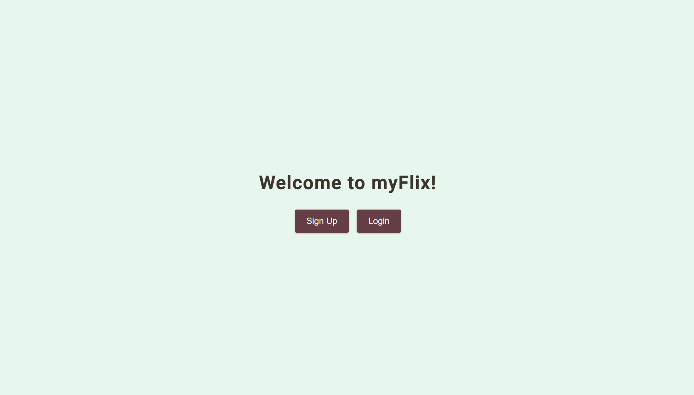
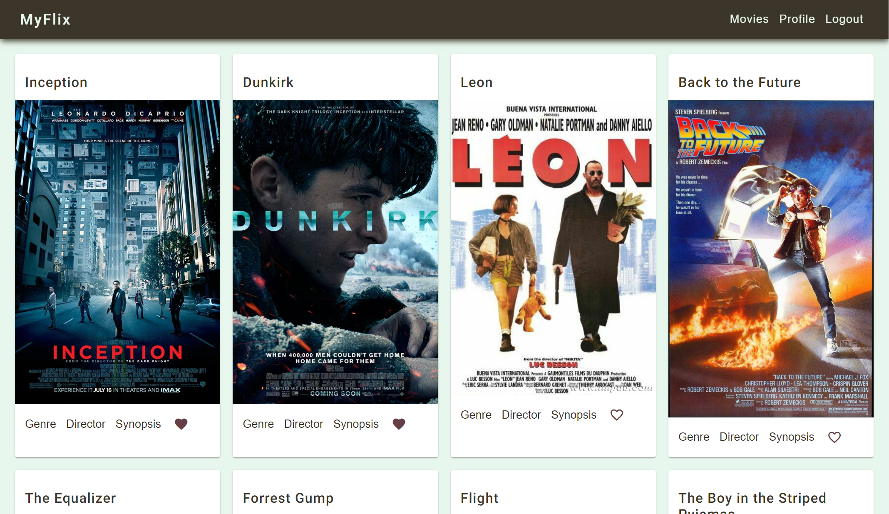
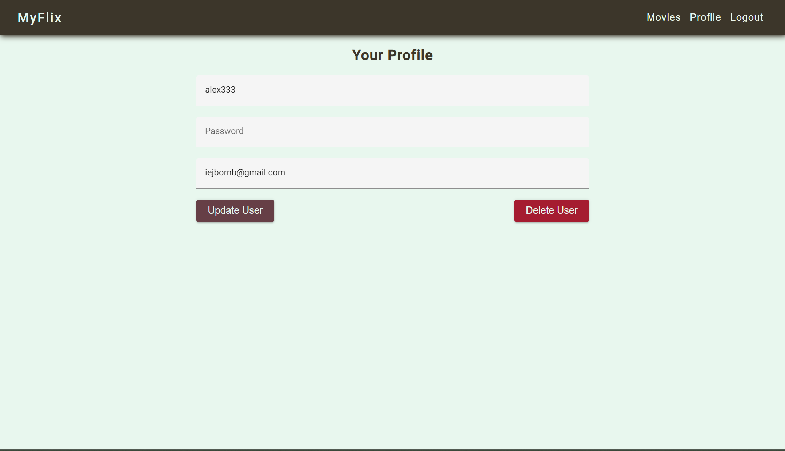
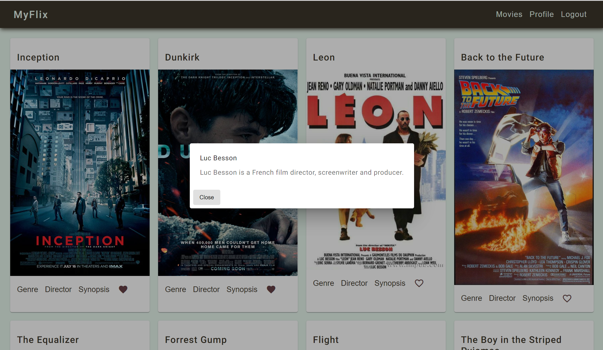

# MyFlix (Angular)
### The application was built using Angular and based on its existing server-side code (REST API and database)
___
## Functionality
* App displays a welcome view where users will be able to either log in or register an account
* Once authenticated, the user now views all movies
* The single movie view contains 4 additional features: 
   1. A button that when clicked takes a user to the director view, where details about the director of that particular movie are displayed
   2. A button that when clicked takes a user to the genre view, where details about that particular genre of the movie are displayed.
   3. A button that when clicked takes a user to the sinopsis view, where description about that particular movie is displayed.
   4. Button to add or remove a movie from the list of favorite movies.
* There is also a view for updating user data or deleting an account
* Convenient navigation through the application using the navbar component that allows the user to switch to the view where all movies are displayed, profile view or logout from the account

 

___

## Link to the [App](https://nnnzrnk.github.io/movie_api-Angular-client/)

This project was generated with [Angular CLI](https://github.com/angular/angular-cli) version 17.0.6.

## Development server

Run `ng serve` for a dev server. Navigate to `http://localhost:4200/`. The application will automatically reload if you change any of the source files.

## Code scaffolding

Run `ng generate component component-name` to generate a new component. You can also use `ng generate directive|pipe|service|class|guard|interface|enum|module`.

## Build

Run `ng build` to build the project. The build artifacts will be stored in the `dist/` directory.

## Running unit tests

Run `ng test` to execute the unit tests via [Karma](https://karma-runner.github.io).

## Running end-to-end tests

Run `ng e2e` to execute the end-to-end tests via a platform of your choice. To use this command, you need to first add a package that implements end-to-end testing capabilities.

## Further help

To get more help on the Angular CLI use `ng help` or go check out the [Angular CLI Overview and Command Reference](https://angular.io/cli) page.
